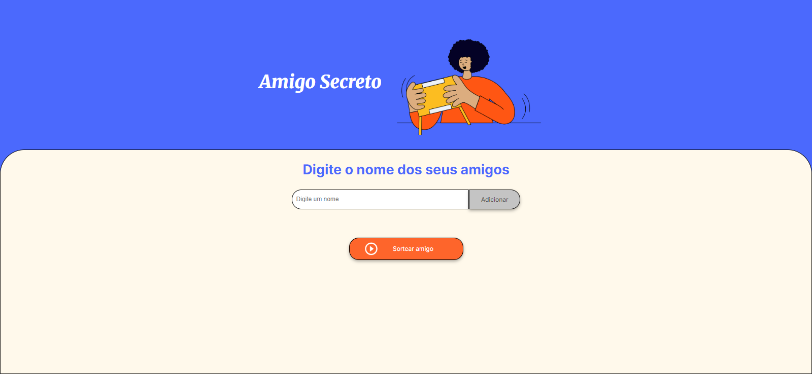

# 🎁 Challenge Amigo Secreto - ONE & Alura

<div align="center">
  

  
  
  
  
  
</div>

## Sobre o Projeto



Este projeto foi desenvolvido para fins educacionais, criado para resolver o **Challenge Amigo Secreto** do curso "Praticando Lógica de Programação" da **ONE (Oracle Next Education)** em parceria com a **Alura**.

A aplicação permite organizar um sorteio de amigo secreto de forma digital, onde os usuários podem adicionar nomes de participantes e realizar o sorteio de forma aleatória e divertida.

**Acesse o projeto online:** [colocar_link_do_site]

## Tabela de conteudos

- [Propósito](#propósito)
- [Objetivos do Challenge](#objetivos-do-challenge)
- [Como Usar](#como-usar)
- [Como Executar o Projeto](#como-executar-o-projeto)
- [Estrutura de Arquivos](#estrutura-de-arquivos)
- [Lógica do Sorteio](#lógica-do-sorteio)
- [Design e UX](#design-e-ux)
- [Contribuições](#contribuições)
- [Referências](#referencias)
- [Aprendizados](#aprendizados)
- [Possíveis Melhorias](#possíveis-melhorias)
- [Contato](#contato)
- [Licença](#licença)

## Propósito

- Exercitar habilidades de lógica de programação com JavaScript
- Praticar manipulação do DOM e interação com o usuário
- Desenvolver algoritmos de sorteio aleatório e validação de dados
- Criar uma interface acessível e responsiva

## Objetivos do Challenge

- Cadastro de participantes com validação de nomes
- Sorteio aleatório entre os participantes
- Prevenção de nomes duplicados e entradas vazias
- Feedback visual para ações do usuário
- Interface adaptável para diferentes dispositivos

## Tecnologias Utilizadas

- **HTML5**: Estrutura semântica
- **CSS3**: Estilos modernos e responsivos
- **JavaScript (ES6+)**: Lógica e interatividade
- **Google Fonts**: Tipografia personalizada

## Como Usar

1. **Adicionar Participantes**
   - Digite o nome no campo e clique em "Adicionar" ou pressione Enter.
   - Repita para todos os participantes.

2. **Realizar Sorteio**
   - Certifique-se de ter pelo menos dois nomes cadastrados.
   - Clique em "Sortear amigo" para ver o resultado.

3. **Novo Sorteio**
   - Clique novamente em "Sortear amigo" para um novo resultado.
   - Para reiniciar a lista, recarregue a página.

## Como Executar o Projeto

### Execução Local

1. **Clone o repositório**
   ```bash
   git clone https://github.com/<seu-usuario>/challenge-amigo-secreto.git
   # Substitua <seu-usuario> pelo seu usuário do GitHub
   ```

2. **Acesse a pasta**
   ```bash
   cd challenge-amigo-secreto
   ```

3. **Abra o projeto**
   - Abra o arquivo `index.html` no navegador
   - Ou utilize o Live Server no VS Code

## Estrutura de Arquivos

```
challenge-amigo-secreto/
├── 📄 index.html          # Estrutura HTML da aplicação
├── 🎨 style.css           # Estilos e layout responsivo
├── ⚡ app.js              # Lógica JavaScript
├── 📖 README.md           # Documentação do projeto
└── 📁 assets/             # Recursos visuais
    ├── 🖼️ amigo-secreto.png
    └── ▶️ play_circle_outline.png
    └── 🖼️ imagem_do_projeto.png
```

### Lógica do Sorteio:

- **adicionarAmigo()**: Adiciona participantes após validação
- **sortearAmigo()**: Realiza o sorteio aleatório, evitando repetições
- **validarEntrada()**: Garante que o nome não seja vazio ou duplicado

## Design e UX

- **Interface intuitiva e minimalista**
- **Alertas e confirmações para ações**
- **Estrutura semântica e responsiva**
- **Acessibilidade com ARIA labels**

## Contribuições

Este projeto foi desenvolvido como parte de um desafio educacional. Sugestões, correções e novas ideias são bem-vindas! Sinta-se à vontade para abrir issues ou pull requests.


## Referências
[tago-dev (Github)](https://github.com/tago-dev/challenge-amigo-secreto)
[W3 schools](https://www.w3schools.com/js/default.asp)

## Aprendizados

- Manipulação do DOM
- Validação de dados
- Algoritmos de aleatoriedade
- Estruturas de dados em JavaScript
- Boas práticas de desenvolvimento web
- Design responsivo

## Possíveis Melhorias

- Adição de efeitos sonoros e visuais
- Animações para o sorteio
- Edição de nomes na lista
- Exportação dos resultados

## Contato

Fique à vontade para entrar em contato para dúvidas, sugestões ou colaborações:

- **Email:** [otavioliraneves@gmail.com.br]
- **LinkedIn:** [Otávio Lira Neves](https://www.linkedin.com/in/otavioliraneves)
- **GitHub:** [OtavioLira](https://github.com/OtavioLira)

## Licença

Este projeto foi desenvolvido para fins educacionais como parte do programa ONE (Oracle Next Education) em parceria com a Alura.

---